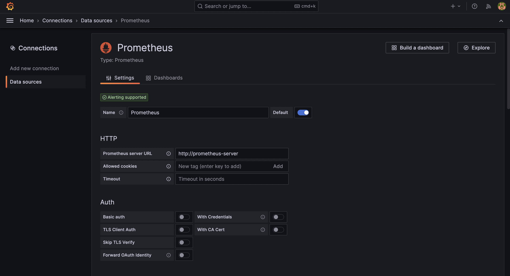
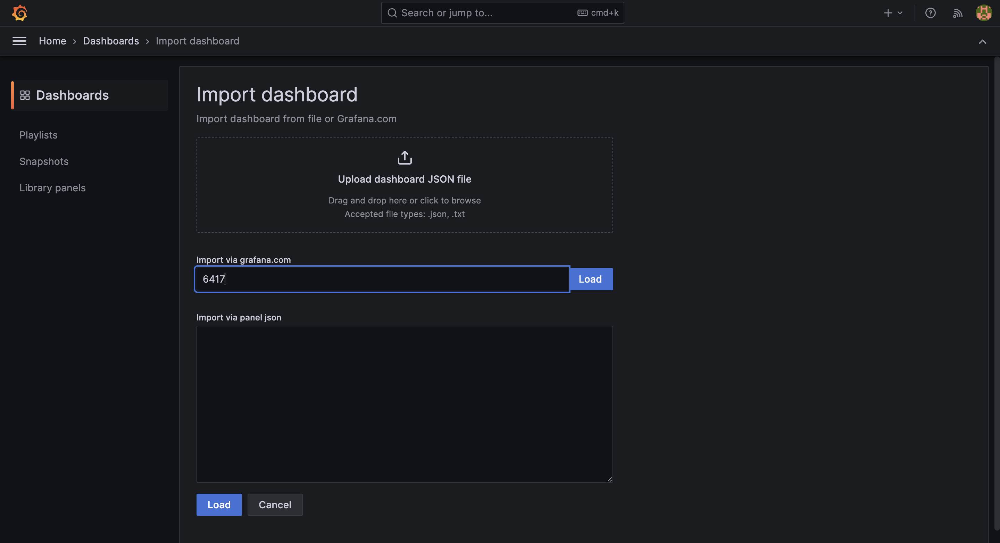
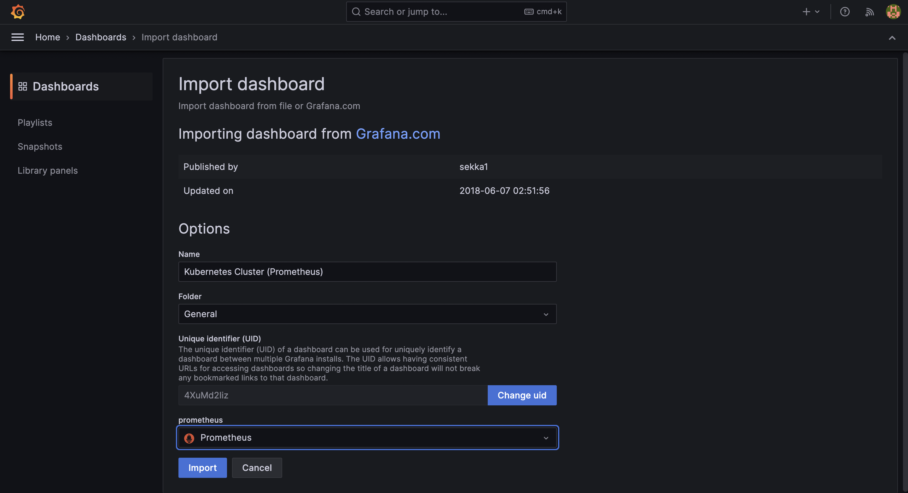
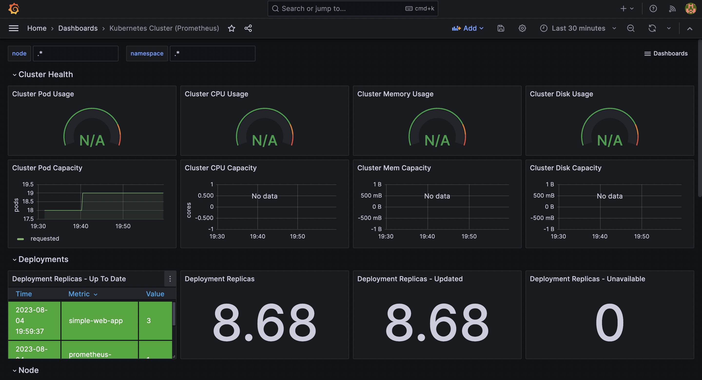
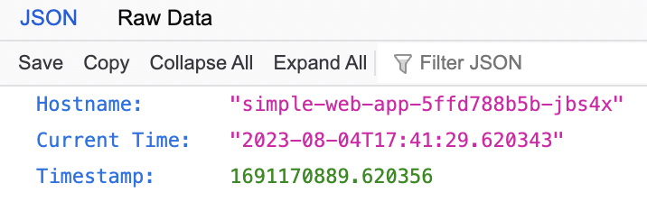
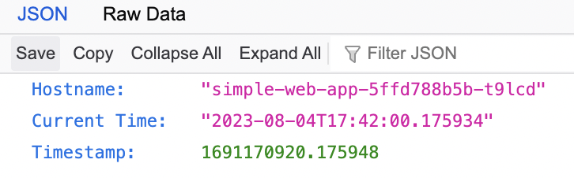
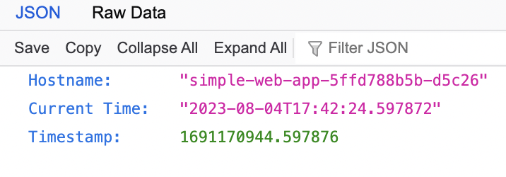

# Simple Web Project

A modern web project to build a simple service with Docker and deploy it to Kubernetes.

The project contains:

- The web service application code written in Python using FastAPI framework that responds to an HTTP GET request and returns Hostname and Timestamp information
- The Dockerfile that packages the application
- The Kubernetes manifests that deploy the application to a Kubernetes environment and provide external access to the application
- Detailed instructions on how to build and deploy the application
- Configuration files to bootstrap the testing environment

## Table of Contents

- [Technologies](#technologies)
- [Requirements](#requirements)
- [Instructions](#instructions)
  - [Build Instructions](#build-instructions)
  - [Deployment Instructions](#deployment-instructions)
- [Accessing The Application](#accessing-the-application)
- [Monitoring Kubernetes Cluster](#monitoring-kubernetes-cluster)
- [Conclusion](#conclusion)
- [Resources](#resources)

## Technologies

This section provides brief information about the technologies used in the project. The technologies used are:

- [Python](https://www.python.org/) programming language for providing the frameworks to build and serve the application
- [FastAPI](https://fastapi.tiangolo.com/) Python framework to build the application
- [Uvicorn](https://www.uvicorn.org/) ASGI web server implementation for Python to serve the application
- [Docker Engine](https://docs.docker.com/engine/) to package the application
- [Minikube](https://minikube.sigs.k8s.io/docs/) for testing the application deployment on Kubernetes
- [kubectl](https://kubernetes.io/docs/tasks/tools/#kubectl) for communicating with the local Kubernetes distribution (Minikube)
- [Prometheus](https://prometheus.io/) to collect k8s cluster metrics
- [Grafana](https://grafana.com/oss/grafana/) to monitor metrics stored on Prometheus

## Requirements

In order the application to be built, deployed, tested and the kubernetes cluster to be monitored successfully, the underlying system should meet the following software:

- Docker
- Minikube
- kubectl
- Helm

> **Tip**
> To check whether the required software installed, execute the [`prereq-checker.sh`](./scripts/prereq-checker.sh) shell script.

> **Note**
> The underlying system should meet the hardware requirements to run above software.

> **Note**
> To prevent possible errors that may occur related to `docker` command permissions, add the user account which will be used to build and deploy the application to **docker** group by executing `sudo usermod -aG docker <username>` command, then log off and log in to the system.

## Instructions

This section provides the instructions on how to build and deploy the application.

> **Tip**
> To build and deploy the application faster in an automated way, the[`setup.sh`](./scripts/setup.sh) can be used.

> **Tip**
> To delete the minikube cluster, prune docker system and close the ssh tunnel, the[`destroy.sh`](./scripts/setup.sh) can be used.

### Build Instructions

To build the application, follow the instructions below:

1. Clone this repository using `git clone` command into the current user's home directory:

```console
cd ; git clone https://github.com/yedaysal/simple-web-project.git
```

2. cd into the local repository directory `~/simple-web-project`:

```console
cd ~/simple-web-project
```

3. Run `docker build` command the package the application:

```console
docker build -t simple-web-app:test .
```

The application Docker image should be ready to be deployed now.

### Deployment Instructions

To deploy the application, follow the instructions below:

1. Start a minikube cluster:

```console
minikube start
```

2. Upload the application Docker image to minikube registry:

```console
minikube image load simple-web-app:test
```

3. Verify that the application Docker image is uploaded to minikube registry:

```console
minikube image ls | grep -w simple-web-app
```

4. Enable minikube ingress addon to deploy ingress-nginx-controller to minikube:

```console
minikube addons enable ingress
```

5. Go to the directory which contains k8s manifests (`~/simple-web-project/k8s`):

```console
cd ~/simple-web-project/k8s
```

6. Apply the application deployment manifest:

```console
kubectl apply -f deployment.yaml
```

7. Apply the application service manifest:

```console
kubectl apply -f service.yaml
```

8. Apply the application ingress manifest:

```console
kubectl apply -f ingress.yaml
```

Now the application should be deployed successfully and accessible via ingress.

## Accessing The Application

The method of accessing the application varies depending on the Docker installation type. If the underlying operating system supports native Docker installation (without Docker Desktop support, e.g. Linux) the application can be accessed directly via the IP address of the minikube container (since the ingress-nginx-controller NodePort service listens on the port 80 in the minikube container):

```console
curl http://$(minikube ip)
```

Otherwise, which means Docker is installed via Docker Desktop support (e.g., macOS and Windows), any connection to the minikube container cannot be established directly since the minikube container runs in a VM managed by Docker Desktop. In this case, an SSH tunnel needs to be opened to the ingress-nginx-controller NodePort service in the minikube container. Open an SSH tunnel using the host port mapped to the minikube container's SSH port:

```console
ssh -f -o UserKnownHostsFile=/dev/null -o StrictHostKeyChecking=no -o IdentitiesOnly=yes -N docker@127.0.0.1 -p $(docker port minikube | grep -w 22 | cut -d ":" -f2) -i ~/.minikube/machines/minikube/id_rsa -L 8181:localhost:80
```

After the execution of the command above, the application should be accessible via [http://localhost:8181](http://localhost:8181) URL.

> **Note**
> To change the port number in the application access URL above, change the port number `8181` at the end of the SSH tunnel command to something else.

To close the tunnel use:

```console
pkill -f "docker@127.0.0.1"
```

## Monitoring Kubernetes Cluster

In order to monitor the kubernetes cluster, follow the instructions below:

1. Add Prometheus helm repository:

```console
helm repo add prometheus-community https://prometheus-community.github.io/helm-charts
```

2. Install the Prometheus helm chart:

```console
helm install prometheus prometheus-community/prometheus
```

3. Expose the prometheus-server deployment via NodePort service:

```console
kubectl expose service prometheus-server --type=NodePort --target-port=9090 --name=prometheus-server-nodeport-service
```

4. Add Grafana helm repository:

```console
helm repo add grafana https://grafana.github.io/helm-charts
```

5. Install the Grafana helm chart:

```console
helm install grafana grafana/grafana
```

6. Expose the grafana deployment via NodePort service:

```console
kubectl expose service grafana --type=NodePort --target-port=3000 --name=grafana-nodeport-service
```

7. Retrieve the grafana `admin` user's password:

```console
kubectl get secret --namespace default grafana -o jsonpath="{.data.admin-password}" | base64 --decode ; echo
```

8. Access the Grafana web interface using the `admin` user and the password retrieved:

```console
minikube service grafana-nodeport-service
```


> **Note**
> `minikube service` command opens an SSH tunnel to the specified service in the minikube container.

> **Note**
> It may take some time for the grafana-nodeport-service to be available. If `minikube service grafana-nodeport-service` gives an error, wait for a while and try executing the command again.

9. Once logged in, go to **Administration -> Data Sources** to add a Prometheus datasource. The URL to the Prometheus instance is the name of the service `http://prometheus-server:80`:



10. Go to **Dashboards -> New -> Import**, enter the dashboard ID `6417` and click on **Load**. On the opening page select Prometheus data source and click on **Import**:




The important dashboard will look like this:



## Conclusion

As a result of the project:

- A web service application that responds to an HTTP GET request and returns Hostname and Timestamp information has been coded and packaged into a Docker image. The image has been kept small.
- The Deployment, Service and Ingress manifests have been written and the application has been deployed to a local kubernetes cluster and accessed via ingress successfully. Currently the application has 3 replicas and the ingress-nginx-controller balances the traffic between them, the traffic is not redirected only one of them.



<p align="center">
  <strong>Response from Pod 1</strong>
</p>

<br>



<p align="center">
  <strong>Response from Pod 2</strong>
</p>

<br>



<p align="center">
  <strong>Response from Pod 3</strong>
</p>

<br>

- A simple monitoring stack consisting of Prometheus and Grafana has been deployed to the local kubernetes cluster and a kubernetes dashboard has been created.
- Documentation and configuration files have been provided via GitHub.

## Resources

- [alpine](https://hub.docker.com/_/alpine)
- [FastAPI](https://fastapi.tiangolo.com/)
- [How can I use Python to get the system hostname?](https://stackoverflow.com/questions/4271740/how-can-i-use-python-to-get-the-system-hostname)
- [Get current timestamp using Python](https://www.geeksforgeeks.org/get-current-timestamp-using-python/)
- [How do I install python on alpine linux?](https://stackoverflow.com/questions/62554991/how-do-i-install-python-on-alpine-linux)
- [Uvicorn - Settings](https://www.uvicorn.org/settings/)
- [How to Use Local Docker Images in Kubernetes](https://sweetcode.io/how-to-use-local-docker-images-in-kubernetes/)
- [Environment-specific instructions](https://kubernetes.github.io/ingress-nginx/deploy/#environment-specific-instructions)
- [Accessing apps
](https://minikube.sigs.k8s.io/docs/handbook/accessing/)
- [How to Reduce Docker Image Size: 6 Optimization Methods](https://devopscube.com/reduce-docker-image-size/)
- [Grep word matching](https://unix.stackexchange.com/questions/409428/grep-word-matching)
- [Minikube IP is not externally accessible via Ingress/ Nodeport Servce](https://github.com/kubernetes/minikube/issues/13951)
- [The Magic Behind the Scenes of Docker Desktop](https://www.docker.com/blog/the-magic-behind-the-scenes-of-docker-desktop/)
- [Accessing Docker Desktop’s Virtual Machine](https://alanastorm.com/accessing-docker-desktops-virtual-machine/)
- [I can't start Minikube](https://stackoverflow.com/questions/66173362/i-cant-start-minikube)
- [Explore networking features](https://docs.docker.com/desktop/networking/#known-limitations-use-cases-and-workarounds)
- [Uvicorn - Introduction](https://www.uvicorn.org/)
- [FastAPI - Installation](https://fastapi.tiangolo.com/#installation)
- [General FAQs for Desktop](https://docs.docker.com/desktop/faqs/general/)
- [How to echo colored text in linux shell script](https://kedar.nitty-witty.com/blog/how-to-echo-colored-text-in-shell-script)
- [How does one output bold text in Bash?](https://stackoverflow.com/questions/2924697/how-does-one-output-bold-text-in-bash)
- [Get string after character [duplicate]](https://stackoverflow.com/questions/15148796/get-string-after-character)
- [Prometheus and Grafana setup in Minikube](https://blog.marcnuri.com/prometheus-grafana-setup-minikube)
- [docker port](https://docs.docker.com/engine/reference/commandline/port/)
- [How can I kill a process by name instead of PID, on Linux? [duplicate]](https://stackoverflow.com/questions/160924/how-can-i-kill-a-process-by-name-instead-of-pid-on-linux)
